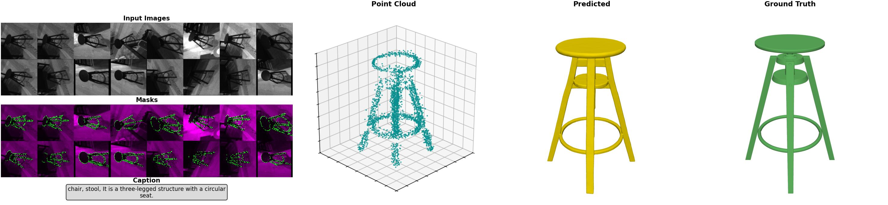

# ShapeR

ShapeR generates complete 3D shape geometry conditioned on multiple modalities for robust object centric reconstruction from casually captured sequences.

## Installation

TODO: Installation instructions will be added once Hugging Face upload is completed.

## Usage

### Inference

```bash
python infer_shape.py --input_pkl <sample.pkl> --config balance --output_dir output
```

**Arguments:**
- `--input_pkl`: Path to preprocessed pickle file (relative to `data/`)
- `--config`: Preset configuration
  - `quality`: 16 views, 50 steps (best quality, slowest)
  - `balance`: 16 views, 25 steps (recommended)
  - `speed`: 4 views, 10 steps (fastest)
- `--output_dir`: Output directory for meshes and visualizations
- `--do_transform_to_world`: Transform output mesh to world coordinates
- `--remove_floating_geometry`: Remove disconnected mesh components (default: on)
- `--simplify_mesh`: Reduce mesh complexity (default: on)
- `--save_visualization`: Save comparison visualization (default: on)

### Example

```bash
python infer_shape.py --input_pkl gaia_29093018117008733__20250415_125853.pkl --config balance
```

**Output:**
- `<name>.glb`: Reconstructed 3D mesh
- `VIS__<name>.jpg`: Visualization comparing input, prediction, and ground truth



## Data Format

This codebase assumes that A sequence has already been processed using the Aria MPS pipeline, along with an 3D object instance detector, resulting in the pickle files with the preprocessed data required for ShapeR ingestion.

We release the **ShapeR Evaluation Dataset** containing preprocessed samples from Aria glasses captures. Each sample is a pickle file with point clouds, multi-view images, camera parameters, text captions, and ground truth meshes.

For a detailed walkthrough of the data format, see the **[`explore_data.ipynb`](explore_data.ipynb)** notebook which includes:
- Complete pickle file structure with all keys and their dimensions
- Interactive 3D visualization of point clouds and meshes
- Camera position visualization
- Image and mask grid displays
- DataLoader usage examples for both SLAM and RGB variants
- Explanation of view selection strategies

## Project Structure

```
ShapeR/
├── infer_shape.py          # Main inference script
├── explore_data.ipynb      # Data exploration notebook
├── dataset/
│   ├── shaper_dataset.py   # Dataset and dataloader
│   ├── image_processor.py  # View selection and image preprocessing
│   └── point_cloud.py      # Point cloud to SparseTensor
├── model/
│   ├── flow_matching/
│   │   └── shaper_denoiser.py  # Flow matching denoiser
│   ├── vae3d/
│   │   └── autoencoder.py      # 3D VAE for mesh generation
│   ├── pointcloud_encoder.py   # Sparse 3D convolution encoder
│   └── dino_and_ray_feature_extractor.py  # Image feature extraction
├── preprocessing/
│   └── helper.py           # Fisheye rectification, camera utils
├── postprocessing/
│   └── helper.py           # Mesh cleanup, visualization
├── checkpoints/            # Model weights (downloaded automatically)
└── data/                   # Input pickle files
```

## License

This source code is licensed under the CC BY-NC 4.0 license. See the [LICENSE](LICENSE) file for details.
